# 🏨 HostelPass --- Smart Hostel Gate Pass Management System

## 📱 About the Project

**HostelPass** is an Android-based **Smart Hostel Gate Pass Management
System** developed using **Kotlin, XML, Firebase Authentication, and
Cloud Firestore**.

The application helps hostels manage student gate passes digitally.
Students can apply for gate passes, parents and rectors can approve or
reject requests, and security guards can verify student entry and exit
using a **QR Code**.

------------------------------------------------------------------------

## 🎯 Aim

To develop a smart and secure hostel gate pass management system that
reduces manual paperwork and provides better communication between
**students, parents, rectors, and security guards**.

------------------------------------------------------------------------

## ✨ Features

### 👨‍🎓 Student

-   Student registration and login
-   View personal profile
-   Apply for a gate pass
-   Enter:
    -   Exit date and time
    -   Return date and time
    -   Place
    -   Reason
    -   Description
-   View submitted gate passes
-   View gate pass details
-   View gate pass status
-   View gate pass history
-   Generate and display QR code after approval
-   Logout

### 👨‍👩‍👦 Parent

-   Parent registration and login
-   View child's information
-   View child's gate pass requests
-   Approve gate pass
-   Reject gate pass
-   View gate pass details
-   View gate pass history
-   View profile
-   Logout

### 👨‍🏫 Rector

-   Rector login
-   View all gate pass requests
-   Approve gate pass
-   Reject gate pass
-   View gate pass details
-   View gate pass history
-   View profile
-   Logout

### 🛡️ Security Guard

-   Security guard login
-   Scan student QR code
-   Verify approved gate pass
-   Record student **EXIT**
-   Record student **ENTRY**
-   View gate records/history
-   View profile
-   Logout

### 👨‍💼 Admin

-   Admin login
-   View total users
-   View total gate passes
-   Access user management
-   Access gate pass management
-   Link parents with students
-   Logout

------------------------------------------------------------------------

## 🔄 Gate Pass Workflow

``` text
Student
   │
   ▼
Apply Gate Pass
   │
   ▼
Parent Approval ──────┐
                      │
                      ▼
                 Rector Approval
                      │
                      ▼
              Both Approved?
                      │
                      ▼
                Gate Pass APPROVED
                      │
                      ▼
                  QR Code
                      │
                      ▼
             Security Guard Scans
                      │
                      ▼
                 Record EXIT
                      │
                      ▼
                   ACTIVE
                      │
                      ▼
             Security Scans Again
                      │
                      ▼
                 Record ENTRY
                      │
                      ▼
                COMPLETED
```

------------------------------------------------------------------------

## 📊 Gate Pass Status

  Status                 Description
  ---------------------- -----------------------------------
  `PENDING`              Gate pass is waiting for approval
  `PARTIALLY_APPROVED`   One authority has approved
  `APPROVED`             Parent and Rector have approved
  `REJECTED`             Gate pass has been rejected
  `ACTIVE`               Student has exited the hostel
  `COMPLETED`            Student has returned
  `EXPIRED`              Gate pass is no longer valid

------------------------------------------------------------------------

## 🛠️ Technologies Used

### Frontend

-   Kotlin
-   XML
-   Android Studio
-   Material Design
-   RecyclerView
-   Material Components

### Backend / Database

-   Firebase Authentication
-   Cloud Firestore

### QR Code

-   ZXing
-   JourneyApps ZXing Android Embedded

### Development Tools

-   Android Studio
-   Gradle
-   Git
-   GitHub

------------------------------------------------------------------------

## 📦 Main Dependencies

``` gradle
Firebase BoM: 34.5.0
Firebase Authentication
Firebase Firestore
ZXing Core: 3.5.3
ZXing Android Embedded: 4.3.0
```

------------------------------------------------------------------------

## 🗂️ Main Firebase Collections

### `users`

Stores user information.

``` text
users
 └── userId
      ├── uid
      ├── name
      ├── email
      ├── role
      └── status
```

Roles:

``` text
student
parent
rector
security
admin
```

### `gatePasses`

Stores student gate pass requests.

``` text
gatePasses
 └── gatePassId
      ├── studentId
      ├── studentName
      ├── parentId
      ├── rectorId
      ├── exitDate
      ├── exitTime
      ├── returnDate
      ├── returnTime
      ├── place
      ├── reason
      ├── description
      ├── parentApproval
      ├── rectorApproval
      ├── status
      ├── qrCode
      └── createdAt
```

### `gateRecords`

Stores security entry and exit records.

``` text
gateRecords
 └── recordId
      ├── gatePassId
      ├── studentId
      ├── securityGuardId
      ├── type
      └── timestamp
```

------------------------------------------------------------------------

# 📸 Application Screenshots


## 🔐 Authentication

## 🔐 Authentication

### Login

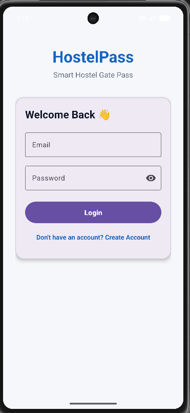

### Student Signup

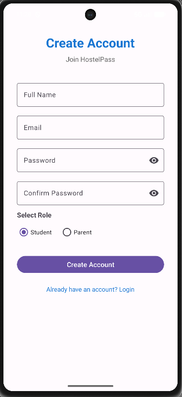

### Parent Signup


------------------------------------------------------------------------

## 👨‍🎓 Student Module

### Student Dashboard

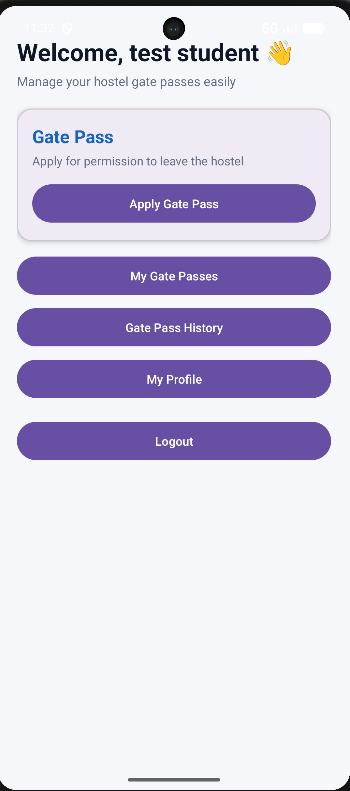

### Apply Gate Pass

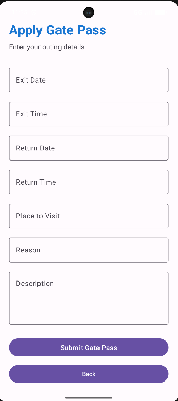

### My Gate Passes

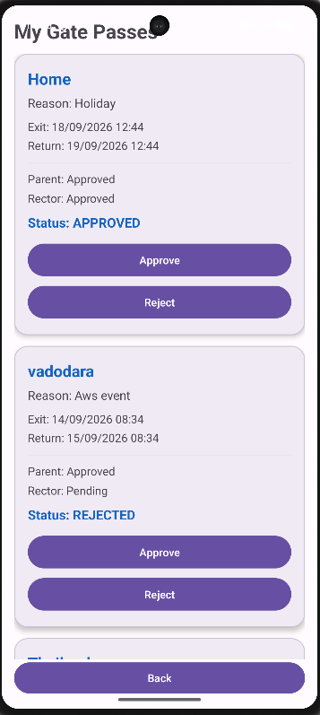

### Gate Pass Details / QR Code

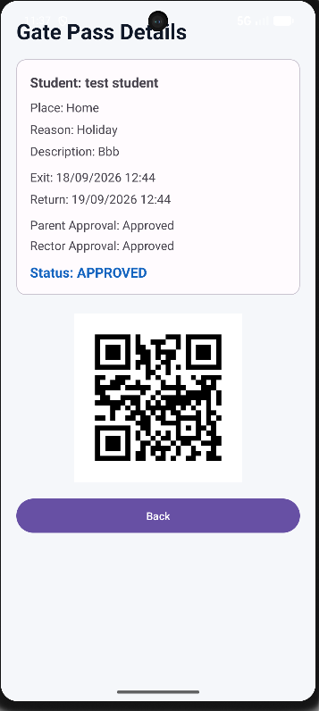

### Student History

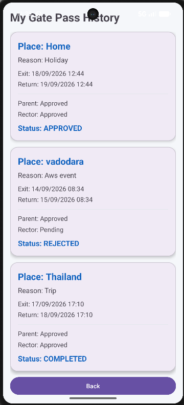

### Student Profile

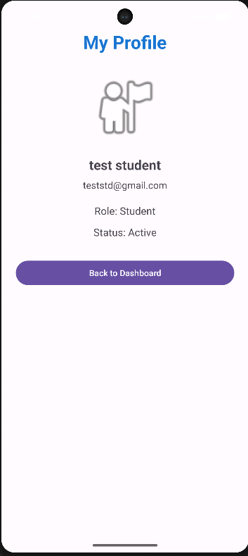

------------------------------------------------------------------------

## 👨‍👩‍👦 Parent Module

### Parent Dashboard

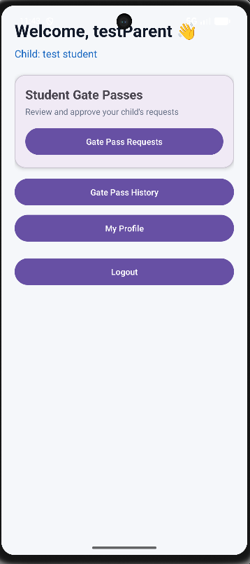

### Child Gate Passes

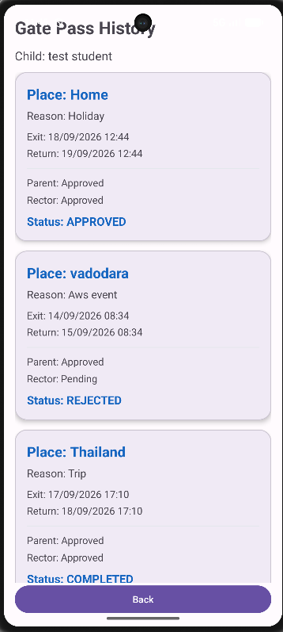

### Parent History


### Parent Profile

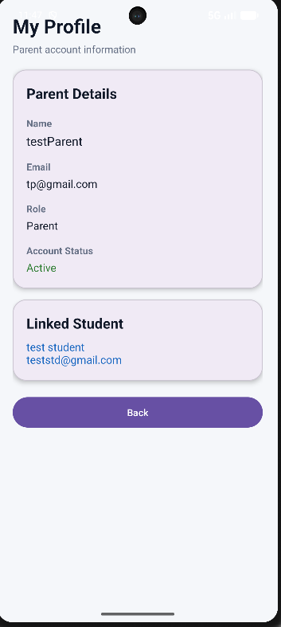
------------------------------------------------------------------------

## 👨‍🏫 Rector Module

### Rector Dashboard

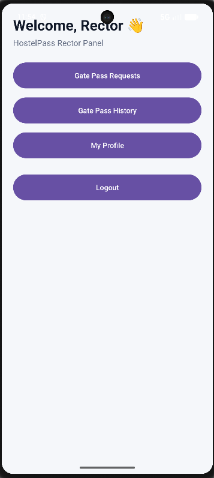

### Gate Pass Requests

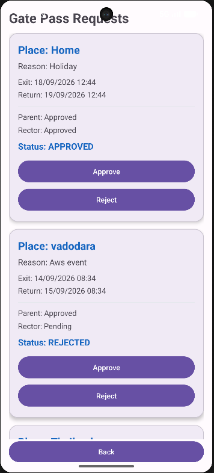

### Rector History


### Rector Profile

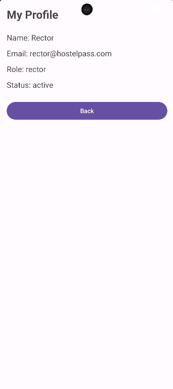

------------------------------------------------------------------------

## 🛡️ Security Guard Module

### Security Dashboard

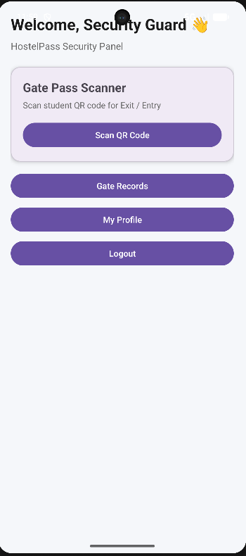

### QR Scanner


### Scanned Gate Pass


### Security History

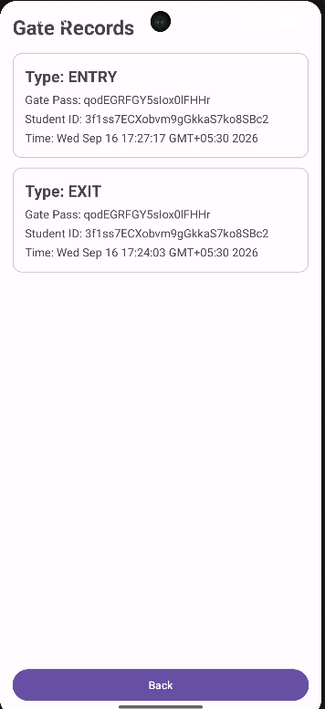

### Security Profile


------------------------------------------------------------------------

## 👨‍💼 Admin Module

### Admin Dashboard

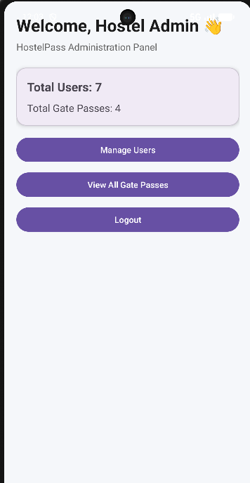

### User Management

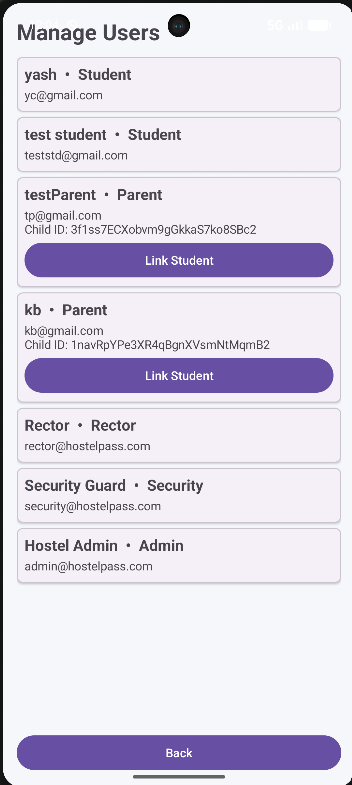

### Gate Pass Management


------------------------------------------------------------------------

## 🔐 Authentication

HostelPass uses **Firebase Authentication with Email and Password**.

After login, the application checks the user's role from Firestore and
automatically opens the appropriate dashboard.

``` text
Login
  │
  ▼
Firebase Authentication
  │
  ▼
Get User Role
  │
  ├── Student  → Student Dashboard
  ├── Parent   → Parent Dashboard
  ├── Rector   → Rector Dashboard
  ├── Security → Security Dashboard
  └── Admin    → Admin Dashboard
```

------------------------------------------------------------------------

## 📷 QR Code System

After both the **Parent** and **Rector** approve a gate pass, the gate
pass becomes:

``` text
APPROVED
```

A QR code is generated using the gate pass ID.

The security guard scans the QR code.

### First Scan

``` text
APPROVED → ACTIVE
```

An `EXIT` record is created.

### Second Scan

``` text
ACTIVE → COMPLETED
```

An `ENTRY` record is created.

------------------------------------------------------------------------

## 📂 Project Structure

``` text
Mad_Project_24012011013
│
├── app
│   ├── src
│   │   └── main
│   │       ├── java/com/example/mad_project_24012011013
│   │       │
│   │       │── MainActivity.kt
│   │       │
│   │       ├── Student
│   │       ├── Parent
│   │       ├── Rector
│   │       ├── Security
│   │       ├── Admin
│   │       │
│   │       └── Adapters
│   │
│   ├── res
│   │   ├── layout
│   │   ├── drawable
│   │   ├── mipmap
│   │   └── values
│   │
│   └── google-services.json
│
├── build.gradle.kts
├── settings.gradle.kts
└── README.md
```

------------------------------------------------------------------------

## 🚀 How to Run the Project

### 1. Clone the Repository

``` bash
git clone https://github.com/yash318/Mad_Project_Gatepass_24012011013.git
```

### 2. Open Project

Open the project in **Android Studio**.

### 3. Connect Firebase

The project uses Firebase Authentication and Cloud Firestore.

Make sure the Firebase configuration file is available:

``` text
app/google-services.json
```

### 4. Sync Gradle

In Android Studio:

``` text
File → Sync Project with Gradle Files
```

### 5. Run the Application

Connect an Android device or start an Android Emulator.

Then click:

``` text
▶ Run
```

------------------------------------------------------------------------

## 🔑 Demo Roles

The application supports the following roles:

  Role       Purpose
  ---------- ----------------------------------
  Student    Apply and track gate passes
  Parent     Approve/reject child's gate pass
  Rector     Approve/reject gate passes
  Security   Scan QR and record entry/exit
  Admin      Manage and monitor the system

> **Note:** Firebase credentials should not be stored publicly in the
> README. Create test users through Firebase Authentication when setting
> up the project.

------------------------------------------------------------------------

## 🔒 Security

The application uses Firebase Authentication for user authentication and
Cloud Firestore for storing application data.

User roles are stored in Firestore and are used for role-based
navigation.

------------------------------------------------------------------------

## 🎓 Academic Project

**Project:** HostelPass --- Smart Hostel Gate Pass Management System

**Technology:** Android / Kotlin / Firebase

**Platform:** Android

**Project Type:** College MAD Project

**Developed By:** Yash Chaudhary

**Enrollment No.:** 24012011013

**College:** U. V. Patel College of Engineering, Ganpat University

------------------------------------------------------------------------

## 📌 Future Enhancements

The following features can be added in future versions:

-   Push notifications using Firebase Cloud Messaging
-   Automatic late-return alerts
-   Profile pictures
-   Advanced gate pass filtering
-   Reports and statistics
-   PDF/Excel report generation
-   Improved admin user management
-   Digital attendance integration
-   Emergency contact notifications

------------------------------------------------------------------------

## ⭐ Conclusion

**HostelPass** provides a digital solution for managing hostel gate
passes. It connects students, parents, rectors, and security guards
through a single Android application.

The system improves the gate pass process by replacing manual paperwork
with **Firebase-based digital records, role-based access, approval
workflows, and QR-based entry/exit tracking**.

------------------------------------------------------------------------

## 📜 License

This project was developed for **educational/academic purposes**.
